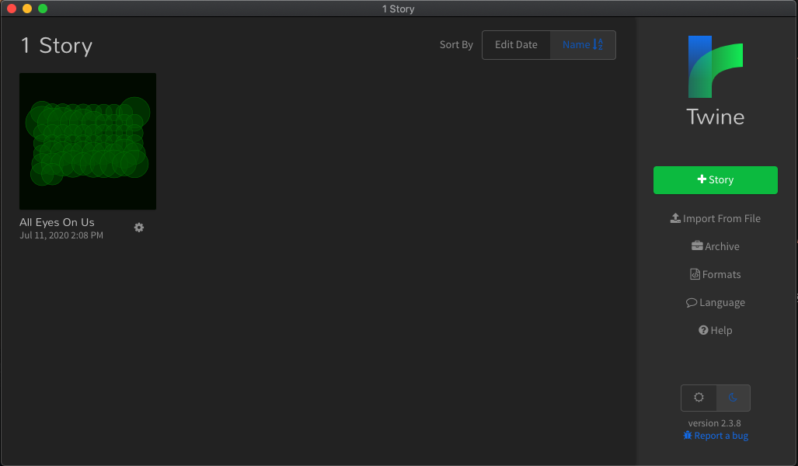

# All Eyes On You - HackNY '20

## Instructions (for non-technical audience with MacOS system)
1. Download <a href = "https://twinery.org/">Twine </a>to make changes to the story 
2. Open the `.dmg` file that was downloaded and drag Twine to your Applications folder
3. `git clone` this repository to your `zsh` or `bash` shell
4. `cd` into the repository named "alleyesonus-demo"
5. Type `open . ` in the terminal to open the folder. Notice the file `aeou.html`
6. Open up the Twine program in your Applications folder
7. Click <b>Import From File</b> on the right hand side. Select `aeou.html` from the repository you downloaded

8. Make changes to the story through the Twine program, click on the "All Eyes On Us" at the bottom. It is advised to write the story changes in a Google Doc first to have a story backup
9. Click <b>Publish to File</b> when you are done making changes to the story
10. Save the `aeou.html` file in the "alleyesonus-demo" folder that you created in steps 3-5 above. 
11. Drag and drop the `aeou.html` file back into this GitHub repository

## Instructions (for technical audience)
1. Install <a href="https://docs.google.com/document/d/1ySomtqfrDbv-7xHlztyh3ZFPGSw8J0h-AhokF1s7w0A/edit?usp=sharing">Twee</a> using Golang
2. `git clone` this repository to your `zsh` or `bash` shell
3. `cd` into the repository named "alleyesonus-demo"
4. Run this command to build the new story changes properly: `tweego -f sugarcube-2 -o aeou.html yjb-game`

## Explanation of Refactoring :)
Within the `yib-game` directory:
* each **scene** and the **intro** has its own folder 
* within the `scene` directory
    * choices - passage listing out available choices
    * long - options a & b
    * short - options a, b, c
    * scenario - passage explaining the situation

Within the `main.twee` file:
* `<<includes PASSAGE_NAME>>` - this will import the contents of the `.twee` file contain the specified passage

## Resources
* [SugarCube v2 Documentation](https://www.motoslave.net/sugarcube/2/docs/) - source of methods and tools for working with Twee, for example: `<<includes passageName>>`

## The Team
Cliff, Diane, Diana, Ian, Chiazo :)

